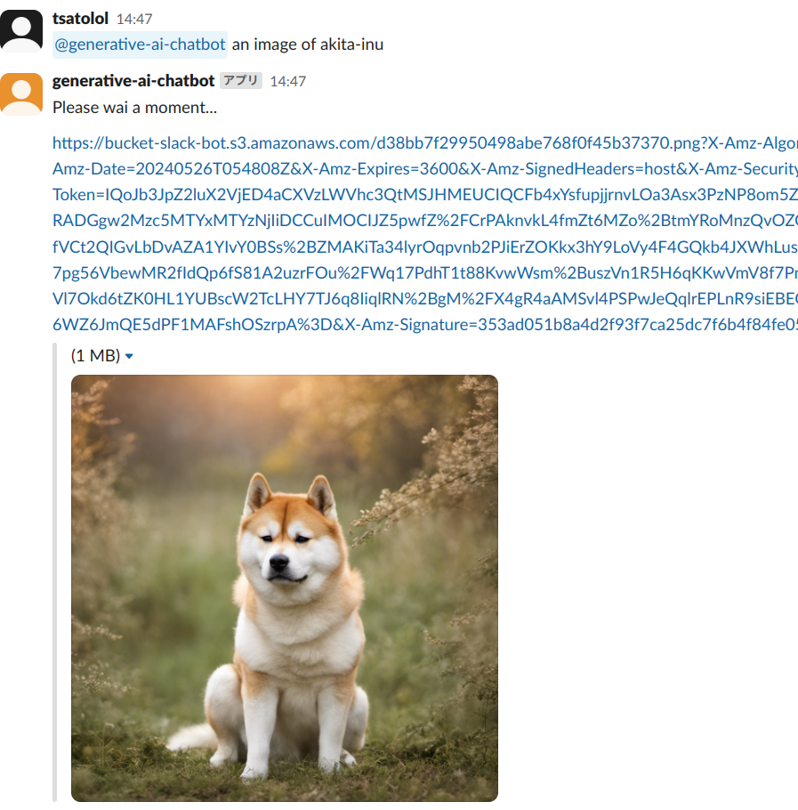
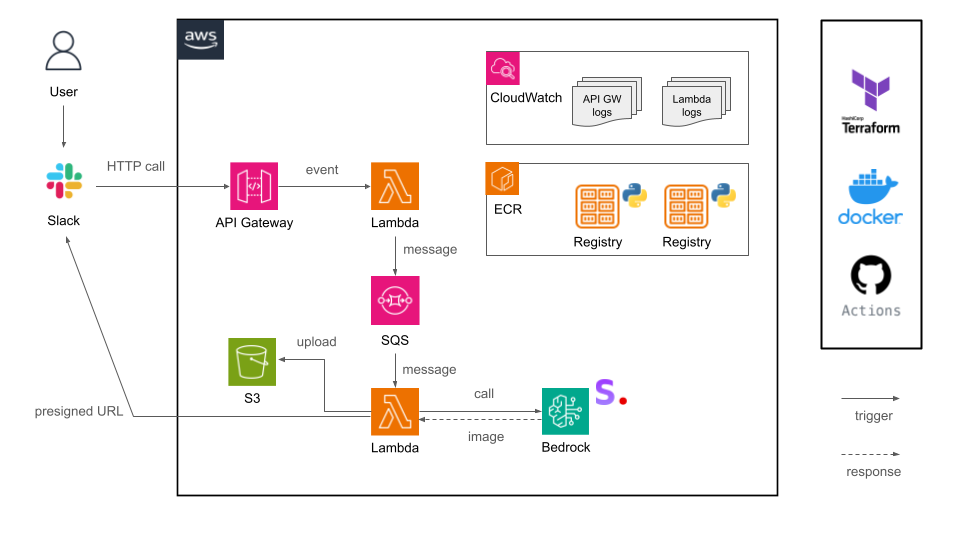

# Slack Text-to-Image Bot

This Slack bot generates images from text inputs using a text-to-image model. It integrates with Slack to allow users to create images directly from their messages.

## Usage


## Features

- Generate images from text inputs
- Integrate seamlessly with Slack
- Easy to deploy and configure

## Prerequisites
- [AWS CLI](https://docs.aws.amazon.com/cli/latest/userguide/getting-started-install.html)
- [Docker](https://docs.docker.com/engine/install/)
- [Terraform](https://developer.hashicorp.com/terraform/tutorials/aws-get-started/install-cli)

## Architecture



## Installation

1. Clone the repository:
```sh
git clone https://github.com/yourusername/slack-text-to-image-bot.git
cd slack-text-to-image-bot
```
2. Create an app, set the bot token scopes. Once the scopes are configured, install the app and get an OAuth token: [https://api.slack.com/quickstart](https://api.slack.com/quickstart)
3. Create `slack-text-to-image-bot/terraform.tfvars` file:
```tf
account_id           = "<YOUR AWS ACCOUNT ID>"
region               = "us-east-1"
slack_bot_token      = "<BOT USER OAUTH TOKEN>"
slack_signing_secret = "<SIGNING SECRET>"
bucket_name          = "<SLACK BOT BUCKET NAME>"
```
4. Deploy the application:
```sh
terraform init
terraform plan
terraform apply
```
5. Event Subscriptions: [https://api.slack.com/quickstart](https://api.slack.com/quickstart)
